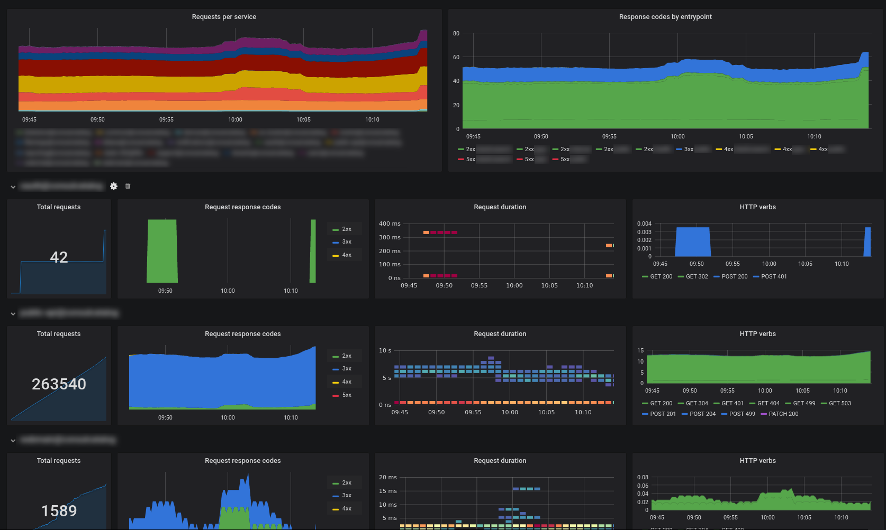

# traefik-grafana-board

A [grafana](https://grafana.com/) configuration for a simple [traefik](https://containo.us/traefik/) dashboard.

It's primarily oriented towards displaying HTTP requests and their status.

You have to [enable prometheus reporting inside traefik](https://docs.traefik.io/observability/metrics/prometheus/) to collect these metrics.

The dashboard consists of an overview over all services and a repeated list of statistics for each service.

You can toggle the services to display by using the `$service` variable and the prometheus source via `$prometheus`.
